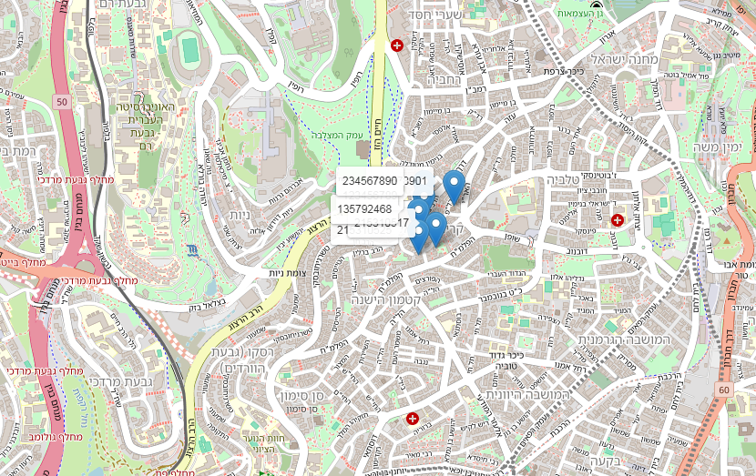
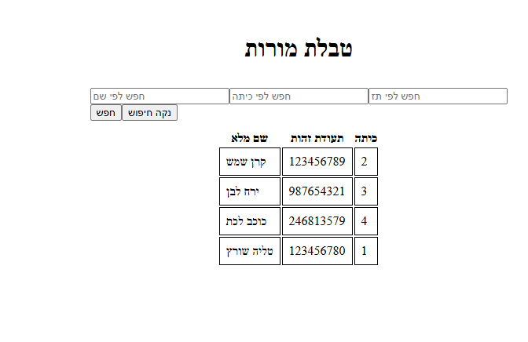
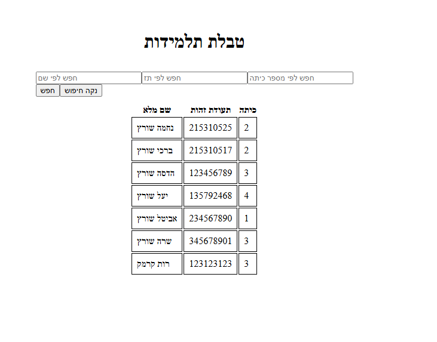

# School Trip Management System

## Description

A trip management system that allows teachers to see students' location on the map in real time

---
## Features

- Add and manage students and teachers.
- Admin access to all data.
- Teacher access limited to their class.
- Filter student and teacher views.
- Live updates of student locations.

###  Locations Map



---
###  Teachers Table



---
###  Students Table



---
## How to use the system
### Login
A user logs in to the system with a username and password.

### Administrator interface
- View all classes, teachers and students in the system
- Add students and teachers
- View all locations on the map

### Teacher interface
Teacher sees only their own class
- View a list of students in an organized table
- Add students
- View student locations in real time on the map


---
## Technologies

### Backend:

* Node.js
* Express
* TypeScript
* Socket.IO
* MongoDB

### Frontend:

* React
* TypeScript
* React Leaflet
* Socket.IO Client

---

## Installation

### 1. Clone the repository

```bash
git clone https://github.com/brachi0525/trip-management-system
```

### 2. Install dependencies

#### Backend:

```bash
cd backend
npm install
```

#### Frontend:

```bash
cd fronted
cd trip-app
npm install
```

---

## Running the Project

### Backend:

```bash
npm run dev
```

### Frontend:

```bash
npm run dev
```

---
## How to Run the Project?

**Before running the project**: create a .env file in the backend folder and add the values:

```env
PORT=3000
JWT_SECRET=super_secret_key
ADMIN_ID=999999999
ADMIN_PASSWORD=999999999
```


To display and update student locations on the map, you need to send a request.
POST http://localhost:3000/map

Send an array of student location:
for example:

```json
[
  {
    "id": 215310525,
    "Coordinates": {
      "Latitude": {  "Degrees": 31, "Minutes": 46,"Seconds": 4 },
      "Longitude": {  "Degrees": 35, "Minutes": 12, "Seconds": 39}
    },
    "Time": "2026-04-25T12:00:00"
  },
  {
    "id": 215310517,
    "Coordinates": {
      "Latitude": { "Degrees": 31,"Minutes": 46, "Seconds": 5 },
      "Longitude": {  "Degrees": 35, "Minutes": 12, "Seconds": 42 }
    },
    "Time": "2026-04-25T12:01:00"
  }
]
```

---
After sending the request the map updates automatically and shows the student locations in real time.
